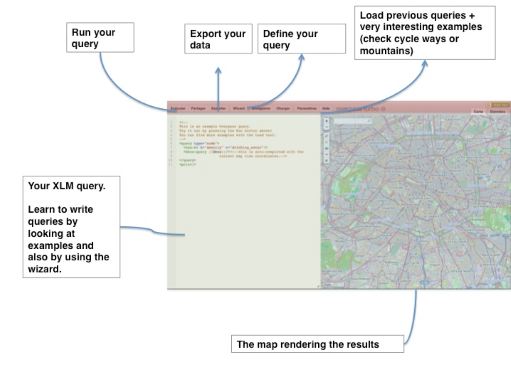

layout: true
  

`r paste0("
", params$event, " 

")` 

---

class: center, middle

Ces slides en ligne : `r paste0("http://datactivist.coop/", params$slug)`

Sources : `r paste0("https://github.com/datactivist/", params$slug)`

Les productions de Datactivist sont librement réutilisables selon les termes de la licence [Creative Commons 4.0 BY-SA](https://creativecommons.org/licenses/by-sa/4.0/legalcode.fr).

 
 

---
## Qui sommes nous ?

    

### We .red[open data], we make them .red[useful]

---
## Qui sommes nous ?

---
## Qui sommes nous ?

- Datactivist est un .red[**pure player de l’open data**] créé en 2016, par Samuel Goëta et Joël Gombin.

- Se positionnant sur .red[**toutes les étapes du travail d’ouverture des données**], Datactivist travaille tant avec les producteurs de données qu’avec les réutilisateurs et participe à l’appropriation des données par chacun.

- Nous appliquons nos propres .red[**valeurs**] : nous sommes une coopérative ; nos supports de formation et nos contenus sont librement réutilisables, publiés en licence Creative Commons.

- Une approche issue de la recherche : voir notamment **https://datactivist.coop/these**. 

- Nous animons la communauté [#TeamOpenData](https://teamopendata.org).

---
## Nos activités

- Conseil sur les .red[**stratégies d’ouverture de données**] : nous aidons les organisations dans la conception et la mise en œuvre de leur stratégie d’ouverture de données.

- .red[**Accompagnement dans la réutilisation de données ouvertes**] : nous aidons les organisations à utiliser les données au quotidien. 

- .red[**Sensibilisation et formation à la donnée**] : nous formons à la culture générale des données, nous enseignons les grands principes et bonnes pratiques de l'open data et nous introduisons à la data science. 

- .red[**Médiation de données**] : nous organisons des hackathons, des open data camps, des expéditions de données...

???

La médiation de données est aussi fondamentalement une animation de communauté(s). 

---
## Pourquoi cartographier ? 

Au départ... cartographier est un projet de puissance ! 

.center[]

---
## Pourquoi cartographier ? 

La cartgraphie est aussi un outil de savoir et de compréhension : il permet d'appréhender le monde et, plus précisément, d'explorer la dimension spatiale des phénomènes physiques ou sociaux.

---
## Pourquoi cartographier ? 

Enfin, la cartographie peut être un outil militant (voir https://neocarto.hypotheses.org/category/cartographie-radicale par exemple) et d'émancipation, d'appropriation d'un territoire vécu voir par exemple https://alterites.hypotheses.org/373). 

---
## Qu'est-ce qu'une carte ?

> "Une carte est une représentation géométrique plane simplifiée et conventionnelle de tout ou partie de la surface terrestre, et cela dans un rapport de similitude convenable qu'on appelle échelle." (F. Joly, 1976)

Référence : [Béguin et Pumain, 2014 (3e éd.)](http://www.persee.fr/web/revues/home/prescript/article/espos_0755-7809_1998_num_16_1_1827_t1_0119_0000_2)

---
## La notion de projection

La projection est l'outil mathématique qui permet de passer du géoïde représentant la Terre à une représentation plane. 

Projections conformes (Mercator, Lambert) ou équivalentes (Eckert IV, Gall). Il y a toujours une déformation !

Les coordonnées géographiques sont exprimées en longitude et latitude. Les unités peuvent être des degrés ou des grades. La projection transforme les coordonnées géographiques en coordonnées x/y. 

---

<iframe width='800' height='600' src='http://bl.ocks.org/syntagmatic/ba569633d51ebec6ec6e'></iframe>

---
class: center, middle

<iframe width="800" height="450" src="https://www.youtube.com/embed/vVX-PrBRtTY" frameborder="0" allowfullscreen></iframe>

---
## L'échelle

L'échelle d'une carte représente le rapport d'une distance mesurée sur la carte à sa valeur réelle sur le terrain.

Échelle        | 1 cm représente
---------------|----------------
1/10000        |100 m
1/25000        |250m
1/50000        |500m
1/100000       |1km
1/1000000      |10km

---
## L'échelle 

Attention : "petite échelle" = grande superficie représentée
"grande échelle" = petite superficie représentée

L'échelle est déformée à distance du centre de projection (équateur pour Mercator)

Échelle numérique et échelle graphique

---
class: center, middle

---
## La généralisation 

"L'opération qui par sélection, schématisation et harmonisation reconstitue sur une carte la réalité de la surface représentée dans ses traits essentiels en fonction du but de la carte, de son thème, de son échelle et des particularités de la région cartographiée."

---
## La sélection 

Quelles couches d'information représenter ? Ni trop (surcharge d'information, à la Google Maps) ni trop peu (rendre la carte intelligible au lecteur).

.center[]

---
## La schématisation 

Opération de simplification, qui peut être structurale (tracés) ou conceptuelle (schéma). Attention : on peut simplifier à partir de données détaillées, mais on ne peut pas faire l'inverse ! Donc toujours veiller à conserver les données dans leur forme la plus détaillée. 

---
## Le fond de carte 

Le fond de carte est constitué des éléments repris d'une carte topographique (par exemple de l'IGN) et utilisés pour une carte thématique.

"Carte reproduite totalement ou partiellement, en une ou plusieurs couleurs souvent atténuées, servant de repère pour le report en surcharge de phénomènes localisables déterminés" (CFC). Peut concerner les découpages administratifs, le réseau routier, hydrographique, les courbes de niveau, etc. 

---
## Les sources de fonds de carte 

Traditionnellement, en France : l'IGN.

De plus en plus : Google Maps, Open Street Map, Stamen...

.center[<iframe src='http://maps.stamen.com/toner/#12/48.8974/2.2017' width='400' height='300'></iframe>]

---
class: middle, center

<iframe src='http://maps.stamen.com/watercolor/#12/48.8974/2.2017' width='400' height='500'></iframe>

---
## Vecteur ou raster 

Comment stocker et représenter l'information géographique ?

- "Mode raster" : il s'agit d'une image, découpée en pixels. Des valeurs sont attribués aux pixels. Ex : photo satellite.
- "Mode vecteur" : on utilise des objets géométriques (lignes, points, polygones...) auxquels sont associés des attributs. Ex : carte d'un réseau de transports.

---
class: middle, center

<iframe width="425" height="300" frameborder="0" scrolling="no" marginheight="0" marginwidth="0" src="http://www.openstreetmap.org/export/embed.html?bbox=2.2066426277160645%2C48.90106358992757%2C2.2182297706604004%2C48.907142665829795&amp;layer=mapnik" style="border: 1px solid black"></iframe> <small><a href="http://www.openstreetmap.org/#map=17/48.90410/2.21244">Voir la carte</a></small>

---
class: middle, center

<iframe src='http://www.comeetie.fr/galerie/francepixels/#' width="425" height="300"></iframe> <small><a href="http://www.comeetie.fr/galerie/francepixels/#">Voir la carte</a></small>

---
## Cartes choroplèthes 

Une carte choroplèthe est une carte thématique où les régions sont colorées ou remplies d'un motif qui montre une mesure statistique, tels la densité de population ou le revenu par habitant. Ce type de carte facilite la comparaison d'une mesure statistique d'une région à l'autre ou montre la variabilité de celle-ci pour une région donnée.

---
## Cartes en anamorphose ou cartogramme 

"La cartographie en anamorphose a pour but d´adapter la forme de la carte non pas à la réalité physique mais plutôt à la réalité perçue." [(Langlois et Denain, 1996)](http://cybergeo.revues.org/129) 

On déforme le fond de carte en fonction d'une variable quantitative (voire arbitrairement).

---
class: middle, center

<iframe src='http://prag.ma/code/d3-cartogram/?segmentized#intlmig/2010' width='500' height='400'></iframe> <small><a href="http://prag.ma/code/d3-cartogram/?segmentized#intlmig/2010">Voir la source</a></small>

---
class: middle, center

---
class: inverse, center, middle

# OpenStreetMap

---
## C'est quoi, OpenStreetMap ?

Une alternative à Google Maps ?

Le Wikipedia de la carte ? 

Ce qu'en dit [Wikipedia](https://fr.wikipedia.org/wiki/OpenStreetMap) :

> un projet de cartographie qui a pour but de constituer une base de données géographiques libre du monde

Un véritable commun numérique, non appropriable (licence [ODbL](https://www.opendatacommons.org/licenses/odbl/)) et [gouverné par sa communauté](https://teamopendata.org/t/openstreetmap-48h-pour-adherer-a-la-fondation-et-re-equilibrer-sa-gouvernance/880).

De multiples projets connexes : [Mapillary](https://www.mapillary.com/) (StreetView libre - voir l'exemple de [Digne](https://www.horizonspublics.fr/territoires/open-data-digne-les-bains-joue-collectif)), [BAN](https://adresse.data.gouv.fr/)/BANO par exemple.

---
## C'est quoi, OpenStreetMap ?

La dimension fondamentale d'OpenStreetMap : il s'agit d'un projet collaboratif et contributif, auquel tout un chacun peut, à sa mesure, contribuer - via des [cartoparties](https://cartopen.com/le-projet-openstreetmap/contribuer-a-openstreetmap) par exemple.

.center[]

---
## C'est quoi, OpenStreetMap ?

.center[]

---

## Petite histoire d'OSM

.pull-left[

* 2004 : lancement par Steve Coast

* Fin 2005 : 1000 usagers

* Aout 2006 : création de la fondation OpenStreetMap

* Décembre 2006 : ajout des images satellite de Yahoo

* Janvier 2013 : 1 million de contributeurs

* Mai 2013 : possibilité de contribuer directement depuis le site

* Mai 2015 : 2 millions de contributeurs
]
.pull-right[
]

---
## Comment collecter des données sur le terrain ?
.reduite[]

---
## Comment soumettre des données ?
.reduite[]

---
## Utiliser OpenStreetMap

- la carte du monde : https://www.openstreetmap.org
- faire une contribution spécifique : https://www.mapcontrib.xyz/
- utiliser des fonds de carte OSM : http://next.openstreetmap.fr/fonds-de-carte/
- utiliser une appli OSM sur mobile : https://www.openstreetmap.fr/gps-applications-de-navigation/

---
class: inverse, middle, center

# Savoir réaliser une carte

---
## Outils cartographiques

Traditionnellement, on fait des cartes avec des outils de SIG (ArcGis, MapInfo, QGIS...) ou purement cartographique (PhilCarto...).

Depuis l'avènement du [geoweb](https://geoviz.sciencesconf.org/data/pages/Visualisation_de_donnees_spatiales_sur_le_Web.pdf), on peut utiliser des outils en ligne, tels que Google Maps, mais aussi Umap, Khartis, Carto... ou encore Mapbox, TileMill, Jawg.io... ou kepler.gl

---
## Outils cartographiques

Que choisir ?

Quand on n'est pas expert :

- carte à destination du web, représentation de figurés ponctuels, linéaires etc. => plutôt Umap

- carte d'analyse, choroplèthe notamment, à partir d'une trame administrative => plutôt Khartis

---
## Khartis

RDV sur http://www.sciencespo.fr/cartographie/khartis/app

Utiliser par exemple ces données : https://trouver.datasud.fr/dataset/population-par-commune-et-tranche-dage-en-region-provence-alpes-cote-dazur-en-2013-indicateur

[Résultat attendu](http://www.sciencespo.fr/cartographie/khartis/app/graph/1cu134g2i0/layer/1cu1357ir2/edit)

---
## Umap

RDV sur https://umap.openstreetmap.fr/fr/

Utiliser par exemple ces données : https://github.com/datactivist/carto/blob/master/data/velo.geojson
(merci à Charles Népote pour les données : https://gist.github.com/CharlesNepote/9806b459d5f7ee671681e55b35cb0a81)

---
class: inverse, center, middle

# Extraire des données d'OpenStreetMap

---
## Les objets d'OpenStreetMap
.reduite[]
.footnote[CC BY-SA esambale on slideshare]

---
## Un monde de tags
.reduite[.center[]]
.footnote[CC BY-SA esambale on slideshare]

---
## Le principe d'un tag : KEY=VALUE
.reduite2[.center[]]
.footnote[CC BY-SA esambale on slideshare]

---
## « Elements cartographiques » : la bible des tags
.reduite2[.center[]]
.footnote[http://wiki.openstreetmap.org/wiki/FR:Éléments_cartographiques]

---
## Comment cartographier un...
.reduite[.center[]]
.footnote[[Lien vers la page wiki](http://wiki.openstreetmap.org/wiki/FR:Comment_cartographier_un..)]

---

## Exercice : trouver les tags suivants

.pull-left[

1. Autoroute 

2. Piste cyclable

3. Musée

4. Aéroport

5. Boulangerie

]

---

## Solution : trouver les tags suivants

.pull-left[

1. Autoroute 

2. Piste cyclable

3. Musée

4. Aéroport

5. Boulangerie
]
.pull-right[
1. Highway=motorway 

2. highway=cycleway ou cycleway=*

3. Tourism=museum

4. Aeroway=aerodrome

5. Shop=bakery]

---

## Découverte d'Overpass
.reduite[]
.footnote[http://overpass-turbo.eu]

---
## Exercice : cartographier les éléments suivants

* Les boulangeries à Angers

* Les pistes cyclables à Auxerre

* Les aéroports en Bourgogne

* Les boites aux lettres à Aix en Provence 

**Plus dur :**

* Les lignes électriques en corse

* Les « potelets » à Marseille

---
class: inverse, center, middle

# Merci !

Contact : [joel@datactivist.coop](mailto:joel@datactivist.coop)

